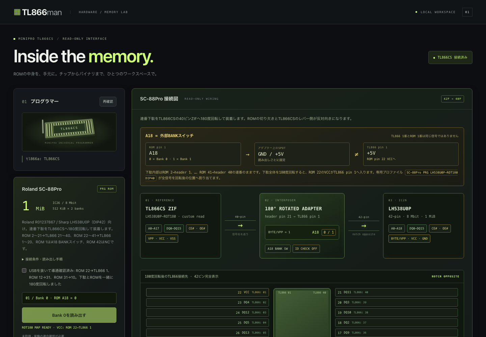

# TL866man

MiniPRO TL866CS を Mac のブラウザから操作する ROM リーダー。
Python 標準ライブラリのローカルサーバーが `minipro` CLI を呼び出します。



## 起動

```sh
brew install minipro
python3 server.py
```

http://127.0.0.1:8660 を開きます。ポート変更は `python3 server.py --port 8661`。
Python 3.9 以降。通常のROM読み出しはWeb用の追加パッケージ、ビルド、外部サービスが不要です。

HSP-08-0をアダプターなしで直接読む場合、またはSC-88Pro用の連番下駄を180度回転して使う場合は、`minipro`のカスタムPROMビットバン拡張を一度ビルドします。ビルド後にサーバーを再起動すると、リポジトリ内のカスタムバイナリを自動的に選択します。

```sh
./tools/build-minipro-hsp.sh
python3 server.py
```

## 使い方

1. TL866CS を USB 接続し「再確認」で接続を確認。
2. チップの印字から型番を検索し、パッケージも一致する候補を選択。
3. チップのデータシートと MiniPRO の装着指示に従って装着位置・向きを確認し、確認欄をチェック。
4. 「ROMを読み出す」をクリック。
5. 読み出し中は進捗バーと取得済みHEXを確認できます。必要なら「読み出しをキャンセル」で停止します。
6. 読み出し速度を選び、完了後にHEX/ASCII、バイト数、SHA-256、タイムスタンプ付き実行ログを確認して「BINを保存」。不要になった内容はメモリビューの「クリア」で消去できます。

一覧は minipro の TL866A/CS データベースです。メモリ以外のデバイスも含まれるため、ROM/EEPROM/Flash の正確な型番を選んでください。対応プロファイルでは、右側にソケットを上から見たグラフィカルなピン配置を表示します。SC-88Proの接続図には、42ピンROM、180度回転した連番下駄、TL866CS、A18バンク切替、2回の読み出しをまとめて表示します。物理レイアウト欄はTL866CSを上から見た回転後の向きで、LH538U0Pの42ピンを省略せず表示します。

## 動作範囲

- 機器確認: `minipro -k`
- 型番一覧: `minipro -q TL866A -l`
- 型番情報: `minipro -q TL866A -d 型番`
- 読み出し: `minipro -p 型番 -c code -r 一時ファイル`
- コードメモリをBINで読み出します。MCUの設定領域などは対象外。
- 書き込み・消去・ファームウェア更新・任意のIDチェック回避は公開しません。SC-88Proの専用アダプターフローのみ読み出し時の `-x` を使用します。
- USB操作は排他制御。通常読み出しのタイムアウトは180秒、SC-88Proの512 KiBバンク読み出しは600秒。
- 全バイトが同じ場合は注意表示。読み出し完了だけでは内容の正しさは保証されません。
- 結果は1件のみメモリ保持。次の読み出し開始またはサーバー終了で失われるため先に保存してください。一時BINは処理後に削除。
- `127.0.0.1` のみにバインド。Host/Origin検査とセッショントークンで他サイトからの読み出し開始を防止。LAN公開用途には対応しません。

実機の読み出しには正確な型番・装着確認が必要です。接続確認とUI確認は、ROM内容の実機検証とは別です。

Backend: [minipro](https://gitlab.com/DavidGriffith/minipro/)

## Roland SC-88Pro PRG ROM (IC26)

実機写真でIC26を `Roland R01237867 / LH538U0P / 9840 D` と確認しました。IC26は8 Mbit（1 MiB）の42ピンマスクROMです。

TL866CS / minipro 0.7.4 では両型番の直接対応がありません。名前の似たMX27C8000@DIP32やUPD27C8001@DIP32は代用しないでください。

専用パネルは **LH538U0PのROM pin 2〜41を40ピンheaderへ順番に出した連番下駄** 向けです。TL866CSのZIF pin 17〜24にはVCC電源ドライバがなく、無回転ではROM pin 22（VCC）がTL866 pin 21へ入るため電源を供給できません。下駄全体を180度回転し、ROM pin 22をTL866 pin 1へ配置します。

ROM pin 1 は A18なので、下駄上の外部スイッチでGND（Bank 0）／+5 V（Bank 1）を選びます。下駄内部はROM pin 2→header pin 1、…、ROM pin 41→header pin 40の連番です。180度回転してTL866CSへ装着すると、ROM pin 2〜21→TL866 pin 21〜40、ROM pin 22〜41→TL866 pin 1〜20になります。ROM pin 42はNCです。`tools/build-minipro-hsp.sh` が `SC-88Pro PRG LH538U0P-ROT180 DIP40` を組み込みます。

1. 下駄をTL866CSへ180度回転して装着。ROM pin 22（VCC）→TL866 pin 1、ROM pin 12/31（GND）→TL866 pin 31/10をテスターで確認します。ROM pin 1はA18スイッチ、pin 42はNCです。
2. Bank 0（ROMワードアドレスA18=0）に設定し確認欄をチェックして読み出し。
3. 完了して「Bank 1の切替待ち」になったらアダプターをBank 1（A18=1）へ切替。スイッチの番号とON/OFFはアダプター依存です。
4. 再度確認欄をチェックしBank 1を読み出し。512 KiB + 512 KiBの容量を検査し、Bank 0→1の順に結合して `SC-88Pro_PRGROM.bin` を保存。

回転下駄のカスタムコマンドは `minipro -p 'SC-88Pro PRG LH538U0P-ROT180 DIP40' -c code -r 一時ファイル -x` です。ID検査を省略し、読み出し専用で動作します。両バンクが同一ならA18切替の未反映を疑う注意を表示します。出力はminiproの生バイト順を保持し、自動バイトスワップはしません。SC-88Pro向けの最終バイト順と内容は実ダンプで検証が必要です。

途中で失敗した場合はBank 0からやり直してください。サーバー再起動で途中データは失われます。取得済みBank 0はBank 1完了までメモリに保持されます。

根拠:

- [Roland SC-88Pro Service Notes (p.3, p.12)](https://www.dosdays.co.uk/media/roland/sc-88/ROLAND_SC-88PRO_SERVICE_NOTES.pdf)
- [silvervest 27Cxxx adapter](https://github.com/silvervest/TL866-27Cxxx-adapter): 27C4096へ変換、27C800は512 KiB×2バンク。
- [GG Labs E2R16](https://gglabs.us/node/2311): 読み出しも27C4096・IDチェックなし、A18バンク切替。

## Famicom MMC1: HSP-08-0 PRG

`HSP-08-0 PRG` は、ゲーム「覇邪の封印」のHVC-SLROM-02（MMC1）基板に載るSharp `LH2310 0S` マスクROMです。容量は128 KiB、パッケージはDIP-28です。ROM選択欄に `HSP-08-0 PRG · LH2310 / DIP-28` と入力すると、Web UIにこのピンアサインが表示されます。

切り欠きを上に見たROM側のピン配置:

| Pin | Signal | Pin | Signal |
| ---: | --- | ---: | --- |
| 1 | PRG A15 | 15 | PRG D3 |
| 2 | PRG A12 | 16 | PRG D4 |
| 3 | PRG A7 | 17 | PRG D5 |
| 4 | PRG A6 | 18 | PRG D6 |
| 5 | PRG A5 | 19 | PRG D7 |
| 6 | PRG A4 | 20 | PRG /CE |
| 7 | PRG A3 | 21 | PRG A10 |
| 8 | PRG A2 | 22 | PRG A16 |
| 9 | PRG A1 | 23 | PRG A11 |
| 10 | PRG A0 | 24 | PRG A9 |
| 11 | PRG D0 | 25 | PRG A8 |
| 12 | PRG D1 | 26 | PRG A13 |
| 13 | PRG D2 | 27 | PRG A14 |
| 14 | GND | 28 | +5V |

この配線はNintendo系128 KiB PRGマスクROMのピン配置です。27C010のJEDECピン配置とは異なります。

標準のHomebrew `minipro`は、カスタムデバイス名を`infoic.xml`へ追加できても、ピン配置そのものは任意に変更できません。`minipro`のPROMビットバン拡張にHSP用のピンテーブルを追加すると、HSP-08-0をDIP-28の位置へ**直接セットして読み出す**ことができます。`./tools/build-minipro-hsp.sh`が、その拡張を適用した`minipro`とデータベースを `.runtime/` に生成します。これは読み出し専用で、IDチェック・書き込み・消去は行いません。

カスタムビルドがない場合は、従来どおり `LH2310 DIP-28 → AM27C010 DIP-32` の信号変換アダプターを使います。UIは実行時にカスタムビルドを検出し、直接モードではZIFへの装着確認、標準モードではアダプター確認を要求します。既製の28→32変換基板を使う場合も、基板の信号表とピン番号を照合してください。

カスタムビルドで直接読む場合は、ROM選択後に右側の図とピン表を確認し、DIP-28の向きどおりに装着して確認欄をチェックします。アダプターモードではサーバーがTL866CSに `AM27C010@DIP32` として読み出しを依頼します。取得した128 KiBをそのまま保存します。マッパーMMC1のバンク切替をソフトウェアで行う処理ではありません。CHR ROM（この基板では別の128 KiB ROM）とMMC1 ICは別部品なので、PRG ROMのダンプだけではカートリッジ全体の `.nes` イメージになりません。

カスタムビットバンの実チップ読み出しはこの環境では未検証です。ピン番号・向き・5V条件を確認し、最初のダンプは内容・サイズ・ハッシュを別手段でも照合してください。

根拠:

- [NesCartDB: Haja no Fuuin](https://nescartdb.com/profile/view/1483/haja-no-fuuin): HSP-08-0、HVC-SLROM-02、MMC1、PRG0 LH2310 128 KiB DIP-28。
- [NESdev: Mask ROM pinout](https://www.nesdev.org/wiki/Mask_ROM_pinout): Nintendo系128/256/512 KiB PRGマスクROMの信号配置。
- [NESdev: MMC1](https://www.nesdev.org/wiki/INES_Mapper_001): MMC1のSxROM構成とPRG/CHRの役割。
- [minipro manual: Adding Custom Chips](https://gitlab.com/DavidGriffith/minipro/-/blob/master/man/minipro.1): カスタムデバイス定義とPROMビットバンの制約。

読み出し速度は「高速／標準／低速・安定／最低速・検証用」から選べます。HSP-08-0のカスタムPROMビットバンでは1バイトごとの待ち時間に反映されます。標準miniproとSC-88Proのアダプター読み出しはTL866CS本体の既定速度です。キャンセル時は取得済みの途中ダンプを保持し、BIN保存は完了した読み出しだけに限定します。
